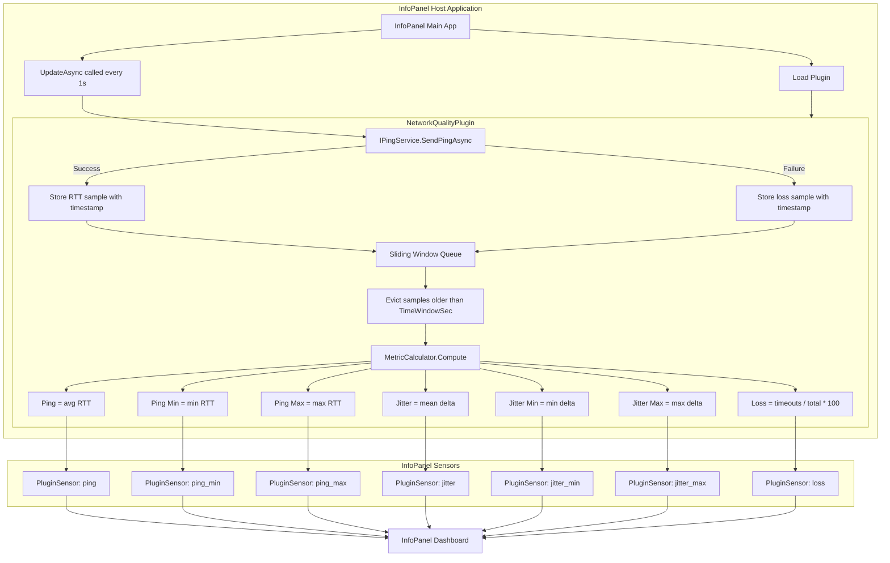
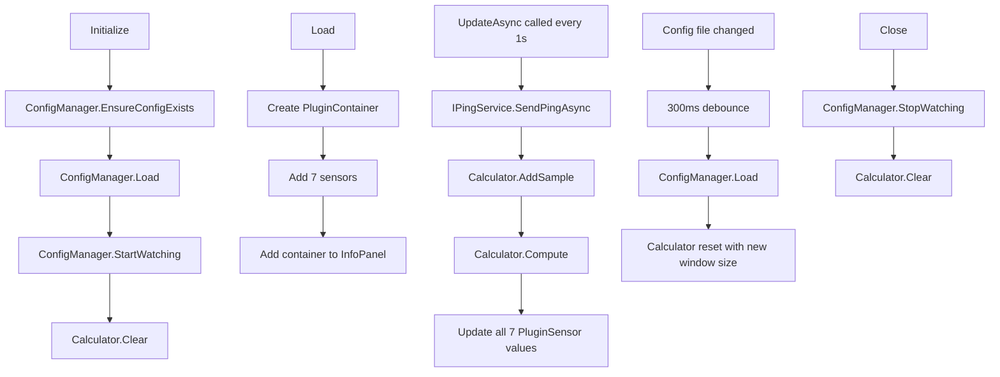

# InfoPanel.NetworkQuality Architecture

## Overview

InfoPanel.NetworkQuality is a C# plugin for the InfoPanel desktop dashboard application. It monitors network quality using ICMP ping and exposes seven metrics: Ping (ms), Ping Min (ms), Ping Max (ms), Jitter (ms), Jitter Min (ms), Jitter Max (ms), and Packet Loss (%).

- Language: C# (.NET 8)
- Framework: InfoPanel.Plugins API
- Communication: ICMP (System.Net.NetworkInformation.Ping)
- Metric Window: Time-based sliding window (default 30 seconds)

## Architecture Diagram



## Class Structure

### NetworkQualityPlugin : BasePlugin

| Member | Type | Description |
|---|---|---|
| −_ping | PluginSensor? | Sensor for average Ping (ms) |
| _pingMin | PluginSensor? | Sensor for minimum Ping (ms) |
| _pingMax | PluginSensor? | Sensor for maximum Ping (ms) |
| _jitter | PluginSensor? | Sensor for average Jitter (ms) |
| _jitterMin | PluginSensor? | Sensor for minimum Jitter (ms) |
| _jitterMax | PluginSensor? | Sensor for maximum Jitter (ms) |
| _loss | PluginSensor? | Sensor for Packet Loss (%) |
| _pingService | IPingService | Service for sending pings |
| _config | IConfigManager | Configuration manager with hot-reload |
| _calculator | IMetricCalculator | Calculator for metrics |

### Sample (Record)

| Field | Type | Description |
|---|---|---|
| Timestamp | DateTime | UTC timestamp of the sample |
| Rtt | float? | Round-trip time in ms, or null for loss |

## Lifecycle


## Metric Calculations

### Ping (Average, Min, Max)

```
Ping = average of all valid RTT samples in the window
Ping Min = minimum RTT in the window
Ping Max = maximum RTT in the window
```

If no valid samples: Ping = Ping Min = Ping Max = 0

### Jitter (Mean, Min, Max)

```
Jitter = average of |RTT[i] - RTT[i-1]| for all consecutive valid RTTs
Jitter Min = minimum absolute delta
Jitter Max = maximum absolute delta
```

If fewer than 2 valid samples: Jitter = Jitter Min = Jitter Max = 0

### Packet Loss

```
PacketLoss = (timeout_count / total_samples) * 100
```

If no samples: PacketLoss = 0

## Configuration

### Config File Path

The config file is auto-generated at:

```
<plugin_dll_directory>/InfoPanel.NetworkQuality.dll.ini
```

### Config File Format

```
[Network]
# Target host to ping (IP address or hostname)
Host = 1.1.1.1

# Time window in seconds (valid: 5-3600, default: 30)
TimeWindowSec = 30

# Ping timeout in milliseconds (valid: 100-5000, default: 1000)
TimeoutMs = 1000
```

### Configuration Loading

1. Initialize() calls ConfigManager.EnsureConfigExists(). This creates config if missing.
2. ConfigManager.Load() reads and parses the .ini file.
3. Values are clamped to safe ranges:

- TimeWindowSec: 5-3600 (5 seconds to 1 hour)
- TimeoutMs: 100-5000 (100 ms to 5 seconds)
4. Hot-reload: FileSystemWatcher with 300 ms debounce applies changes instantly.

### Empty Host Fallback

If Host is empty or whitespace, it falls back to 1.1.1.1.

## Threading Model

| Component | Thread | Notes |
|---|---|---|
| Initialize() | Main/UI thread | Called once at plugin load |
| Load() | Main/UI thread | Called once at plugin load |
| UpdateAsync() | Background thread | Called every 1 second via Task.Run |
| MetricCalculator | Shared | Thread-safe with locking |
| ConfigManager | Shared | FileSystemWatcher events on thread pool |

The plugin uses ConfigureAwait(false) in UpdateAsync to avoid capturing the synchronization context.

## Logging

- Logs to %localappdata%\InfoPanel.NetworkQuality\log.txt
- Includes config loads, ping errors, config reloads, startup, and shutdown events
- Auto-rotates at 1 MB (keeps .old.txt backup)

## Dependencies

| Dependency | Version | Purpose |
|---|---|---|
| −InfoPanel.Plugins | (referenced as .dll) | InfoPanel plugin API |
| System.Net.NetworkInformation | .NET 8 | ICMP ping |
| System.Reflection | .NET 8 | Assembly location for config path |
| System.Collections.Generic | .NET 8 | Queue<T> |

External dependencies: None beyond the .NET 8 standard library and the InfoPanel.Plugins reference.

## Performance Characteristics

| Metric | Value |
|---|---|
| Update interval | 1 second |
| Ping timeout | Default 1000 ms |
| Window size | Default 30 samples |
| Memory usage | Approximately 30 Sample objects (negligible) |
| CPU usage | Minimal (async ping with ConfigureAwait) |

## Error Handling

| Scenario | Behavior |
|---|---|
| Ping returns IPStatus.Success | Store RTT |
| Ping returns any other status | Store null (counts as loss) |
| Ping throws exception | Store null (counts as loss) |
| Config file missing | Auto-generated with defaults |
| Config parse error | Continue with current values, log error |
| Empty host in config | Falls back to 1.1.1.1 |

## Design Principles

### Time-Based Sliding Window

- Configurable duration (default 30 s)
- Samples automatically evicted when older than window
- Provides consistent behavior regardless of network latency

### Graceful Degradation

- Missing config -> defaults
- Network errors -> counted as loss (correct denominator)
- Exceptions -> caught and logged

### Thread Safety

- lock protects queue operations in MetricCalculator
- lock protects config reload in ConfigManager

### Separation of Concerns

- NetworkQualityPlugin: Orchestration only
- IPingService: Ping logic
- IMetricCalculator: Sliding window and calculations
- IConfigManager: INI loading and hot-reload
- Logger: File logging

## Project Structure

```
InfoPanel.NetworkQuality/
├── InfoPanel.NetworkQuality/
│   ├── Calculators/
│   │   ├── IMetricCalculator.cs
│   │   └── MetricCalculator.cs
│   ├── Config/
│   │   ├── IConfigManager.cs
│   │   └── ConfigManager.cs
│   ├── Logging/
│   │   └── Logger.cs
│   ├── Models/
│   │   └── Sample.cs
│   ├── Services/
│   │   ├── IPingService.cs
│   │   └── PingService.cs
│   ├── InfoPanel.NetworkQuality.csproj
│   ├── NetworkQualityPlugin.cs
│   └── PluginInfo.ini
├── .gitignore
├── InfoPanel.NetworkQuality_ARCHITECTURE.md
├── LICENSE
└── README.md
```

## Current Status

- ICMP ping sampling working
- Time-based sliding window implemented
- All 7 metrics calculated correctly
- Config file generation and loading
- Config hot-reload with debounce
- File logging with rotation
- Thread-safe operations
- Async update loop
- Graceful error handling

Ready for release.

## Known Limitations

| Limitation | Impact |
|---|---|
| Only ICMP (IPv4) | IPv6 not supported |
| Single target host | Cannot monitor multiple hosts |
| No retry on failure | Failed pings are counted as loss |
| No persistence | Samples reset on plugin reload |

