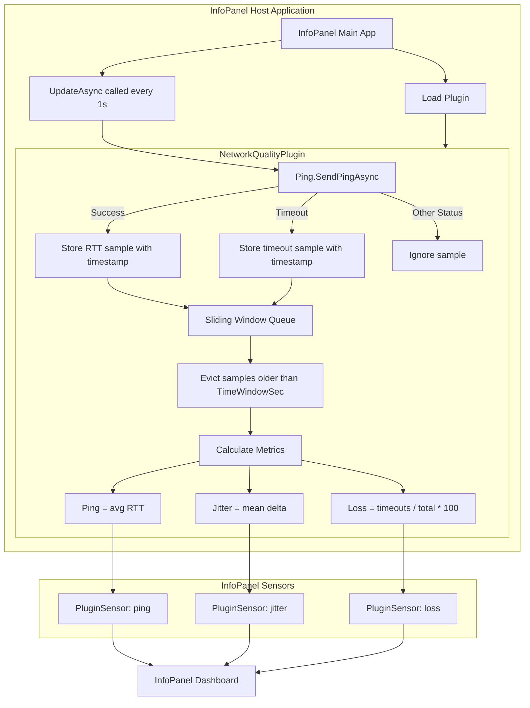
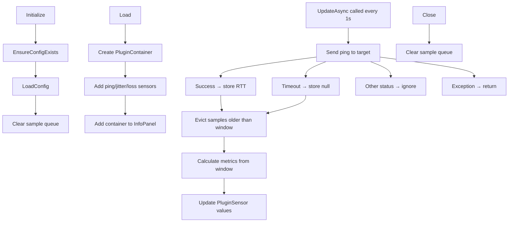

# InfoPanel.NetworkQuality Architecture

## Overview

InfoPanel.NetworkQuality is a C# plugin for the InfoPanel desktop dashboard application. It monitors network quality using ICMP ping and exposes three metrics: Ping (ms), Jitter (ms), and Packet Loss (%).

- **Language:** C# (.NET 8)
- **Framework:** InfoPanel.Plugins API
- **Communication:** ICMP (System.Net.NetworkInformation.Ping)
- **Metric Window:** Time‑based sliding window (default 30 seconds)

---

## Architecture Diagram



---

## Class Structure

### `NetworkQualityPlugin` : `BasePlugin`

| Member | Type | Description |
|--------|------|-------------|
| `ping` | `PluginSensor?` | Sensor for Ping (ms) |
| `jitter` | `PluginSensor?` | Sensor for Jitter (ms) |
| `packetLoss` | `PluginSensor?` | Sensor for Packet Loss (%) |
| `targetHost` | `string` | Target IP/hostname (default: `1.1.1.1`) |
| `timeWindowSec` | `int` | Sliding window duration (default: 30s) |
| `timeoutMs` | `int` | Ping timeout (default: 1000ms) |
| `samples` | `Queue<Sample>` | Thread-safe sample queue |

### `Sample` (Nested Struct)

| Field | Type | Description |
|-------|------|-------------|
| `Timestamp` | `DateTime` | UTC timestamp of the sample |
| `Rtt` | `float?` | Round-trip time in ms, or `null` for timeout |

---

## Lifecycle



---

## Metric Calculations

### Ping (Average RTT)

```
Ping = average of all valid RTT samples in the window
```

If no valid samples: `Ping = 0`

### Jitter (Mean Absolute Delta)

```
Jitter = average of |RTT[i] - RTT[i-1]| for all consecutive valid RTTs
```

If fewer than 2 valid samples: `Jitter = 0`

### Packet Loss

```
PacketLoss = (timeout_count / total_samples) * 100
```

If no samples: `PacketLoss = 0`

---

## Configuration

### Config File Path

The config file is auto-generated at:

```
<plugin_dll_directory>/InfoPanel.NetworkQuality.dll.ini
```

### Config File Format

```ini
[Network]
# Target host to ping (IP address or hostname)
Host = 1.1.1.1

# Time window in seconds (valid: 5-3600, default: 30)
TimeWindowSec = 30

# Ping timeout in milliseconds (valid: 100-5000, default: 1000)
TimeoutMs = 1000
```

### Configuration Loading

1. `Initialize()` calls `EnsureConfigExists()` — creates config if missing
2. `LoadConfig()` reads and parses the `.ini` file
3. Values are **clamped** to safe ranges:
   - `TimeWindowSec`: 5–3600 (5 seconds to 1 hour)
   - `TimeoutMs`: 100–5000 (100ms to 5 seconds)

---

## Threading Model

| Component | Thread | Notes |
|-----------|--------|-------|
| `Initialize()` | Main/UI thread | Called once at plugin load |
| `Load()` | Main/UI thread | Called once at plugin load |
| `UpdateAsync()` | Background thread | Called every 1 second via `Task.Run` |
| `samples` queue | Shared | `lock(samples)` ensures thread safety |

**Note:** The plugin uses `ConfigureAwait(false)` in `UpdateAsync` to avoid capturing the synchronization context, preventing potential deadlocks.

---

## Dependencies

| Dependency | Version | Purpose |
|------------|---------|---------|
| `InfoPanel.Plugins` | (referenced as .dll) | InfoPanel plugin API |
| `System.Net.NetworkInformation` | .NET 8 | ICMP ping |
| `System.Reflection` | .NET 8 | Assembly location for config path |
| `System.Collections.Generic` | .NET 8 | Queue<T> |

**External dependencies:** None beyond the .NET 8 standard library and the InfoPanel.Plugins reference.

---

## Performance Characteristics

| Metric | Value |
|--------|-------|
| Update interval | 1 second |
| Ping timeout | Default 1000ms |
| Window size | Default 30 samples |
| Memory usage | ~30 `Sample` objects (negligible) |
| CPU usage | Minimal (async ping with ConfigureAwait) |

---

## Error Handling

| Scenario | Behavior |
|----------|----------|
| Ping returns `IPStatus.Success` | Store RTT |
| Ping returns `IPStatus.TimedOut` | Store `null` (counts as loss) |
| Ping returns other status | Ignore sample entirely |
| Ping throws exception | Catch and return (no sample added) |
| Config file missing | Auto‑generated with defaults |
| Config parse error | Continue with current values |

---

## Design Principles

### Time‑Based Sliding Window

- Configurable duration (default 30s)
- Samples automatically evicted when older than window
- Provides consistent behavior regardless of network latency

### Graceful Degradation

- Missing config → defaults
- Network errors → no sample added (doesn't skew metrics)
- Exceptions → caught and ignored

### Thread Safety

- `lock(samples)` protects queue operations
- Sensor references captured at start of `UpdateAsync` to avoid stale pointer issues

### Single Responsibility

- `NetworkQualityPlugin`: Orchestration only
- Ping logic: Inline in `UpdateAsync`
- Config management: Separate methods

---

## Project Structure

```
InfoPanel.NetworkQuality/
├── InfoPanel.NetworkQuality/
│   ├── InfoPanel.NetworkQuality.csproj    # .NET 8 project
│   ├── NetworkQualityPlugin.cs            # Main plugin class
│   └── PluginInfo.ini                     # Plugin metadata
├── InfoPanel.NetworkQuality.sln           # Solution file (root)
├── InfoPanel.NetworkQuality_ARCHITECTURE.md
└── README.md
```

---

## Current Status

- ✅ ICMP ping sampling working
- ✅ Time‑based sliding window implemented
- ✅ All three metrics calculated correctly
- ✅ Config file generation and loading
- ✅ Thread‑safe queue operations
- ✅ Async update loop
- ✅ Graceful error handling

**Ready for release.**

---

## Known Limitations

| Limitation | Impact |
|------------|--------|
| Only ICMP (IPv4) | IPv6 not supported |
| Single target host | Cannot monitor multiple hosts |
| No retry on failure | Failed pings are simply counted as loss |
| No persistence | Samples reset on plugin reload |
| Config reload requires restart | Changes require plugin reload |